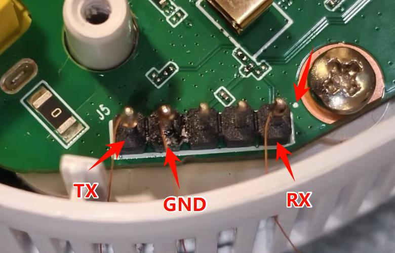

# W1701K 刷机教程

本教程旨在指导您如何通过 TTL 方式刷入 W1701K 路由器的内存固件。请仔细阅读并按照步骤操作。

## 准备工作

在开始刷机之前，请确保您已准备好以下物品和软件：

*   **W1701K 路由器**: 待刷机的设备。
*   **USB 转 TTL 模块**: 用于连接路由器和电脑的串口通信工具。
*   **杜邦线**: 连接 TTL 模块和路由器主板上的 TTL 接口。
*   **电脑**: 运行 Windows、macOS 或 Linux 操作系统。
*   **串口终端软件**: 例如 PuTTY (Windows)、SecureCRT (Windows)、minicom (Linux) 或 Serial (macOS)，用于通过 TTL 模块与路由器进行通信。
*   **TFTP 客户端软件**: 例如 TFTPD64 (Windows) 或 tftp (Linux/macOS 命令行工具)，用于在电脑和路由器之间传输固件文件。
*   **内存固件文件**: 适用于 W1701K 的 `initramfs-uImage.itb` 或类似文件。请确保您已将固件文件放置在 TFTP 客户端软件的当前工作目录下。

## TTL 连接

1.  **识别 TTL 接口**: 在 W1701K 路由器主板上找到 TTL 接口。
    
2.  **连接杜邦线**:
    *   将 TTL 模块的 GND 连接到路由器主板的 GND。
    *   将 TTL 模块的 RX 连接到路由器主板的 TX。
    *   将 TTL 模块的 TX 连接到路由器主板的 RX。
    *   **注意**: VCC 引脚通常不需要连接，以免供电冲突。如果您的 TTL 模块有 3.3V/5V 跳线，请确保设置为 3.3V。
    *   **特别说明**: W1701K 背部有交流电插脚，建议使用漆包线将 TTL 引出机身外，以便后盖恢复。
3.  **连接电脑**: 将 USB 转 TTL 模块连接到电脑的 USB 端口。

## 刷机步骤

### 1. TTL 操作 (U-Boot 阶段)

1.  **打开串口终端**: 在电脑上打开您选择的串口终端软件，配置正确的串口号（COM 端口）和波特率（通常为 115200）。
2.  **上电打断**: 给 W1701K 路由器上电开机，在串口终端中看到启动信息时，迅速按下任意按键（例如空格键或回车键），以打断 U-Boot 启动过程，进入 U-Boot 命令行界面。
3.  **设置环境变量**: 依次输入以下命令，每输入一行后按回车键执行。

    ```bash
    setenv bootflag 0
    setenv one flash read 0x600000 0x1000000 $loadaddr
    setenv two "; bootm"
    setenv bootcmd "$one$two"
    setenv one
    setenv two
    setenv ipaddr 192.168.1.10
    setenv serverip 192.168.1.20
    saveenv
    ```

4.  **断电重启并打断**: 断开 W1701K 路由器的电源，然后重新上电。在串口终端中再次迅速按下任意按键，打断 U-Boot 启动过程，进入 U-Boot 命令行界面。
5.  **设置加载地址**: 输入以下命令设置固件加载到内存的地址。

    ```bash
    setenv loadaddr 0x89000000
    ```

### 2. PC 端 TFTP 传输固件

1.  **配置电脑网络**: 将您的电脑的 IP 地址设置为与 `serverip` 相同的网段，例如 `192.168.1.20`，子网掩码 `255.255.255.0`。
2.  **使用 TFTP 客户端 `put` 固件**: 在您的电脑上，打开命令行工具（如 Windows 的 CMD 或 PowerShell，Linux/macOS 的终端），使用 TFTP 客户端软件的 `put` 功能将固件文件传输到 W1701K。

    ```bash
    # 示例：使用 Windows 的 tftp 命令行工具
    tftp -i 192.168.1.10 put openwrt-airoha-an7581-gemtek_w1700k-initramfs-uImage.itb
    ```
    请将 `openwrt-airoha-an7581-gemtek_w1700k-initramfs-uImage.itb` 替换为您的实际固件文件名。

### 3. 启动固件

1.  **启动内存固件**: 固件传输完成后，在 U-Boot 命令行界面输入以下命令启动固件。

    ```bash
    bootm 0x89000000
    ```

### 4. 刷入持久化固件 (SquashFS)

通过上述步骤启动的固件是 `initramfs` 内存固件，它只在内存中运行，断电后会丢失。为了使系统持久化，您需要刷入 `squashfs` 固件。

1.  **进入临时系统**: 路由器启动 `initramfs` 固件后，您将进入一个临时的 OpenWrt 系统。您可以通过网线连接路由器，并尝试通过 Web 界面 (LuCI，通常是 `http://192.168.1.1`) 访问路由器。
2.  **上传 SquashFS 固件**: 如果临时系统有 LuCI 界面，可以通过“系统” -> “备份/刷写固件” -> “刷写新的固件”选项上传固件文件。
3.  **刷写 SquashFS 固件**: 在 LuCI 界面中，选择您上传的 `squashfs` 固件文件，然后点击“刷写”按钮。请确保选择保留配置（如果需要）。
    *   **固件下载地址**: 您可以在 [https://github.com/ZqinKing/wrt_release/releases](https://github.com/ZqinKing/wrt_release/releases) 下载适用于 W1701K 的 `squashfs` 固件。
4.  **等待重启**: 刷写过程完成后，路由器会自动重启。重启后，您的 W1701K 将运行新的 `squashfs` 固件，并且系统配置将持久化。

## 注意事项

*   在设置 IP 地址时，请确保 W1701K 的 `ipaddr` 和 PC 的 `serverip` 在同一网段，并且 PC 的实际 IP 地址与 `serverip` 一致。
*   请务必使用正确的固件文件，并将其放置在 TFTP 客户端软件的当前工作目录下。
*   在执行 `saveenv` 命令后，请务必断电重启，以确保环境变量生效。
*   **重要**: 本教程假设 W1701K 在 U-Boot 阶段能够作为 TFTP 服务器接收来自 PC 端的 `put` 操作。如果您的 W1701K 无法接收 `put`，您可能需要查阅其他资料或尝试其他刷机方法。
*   如果在任何步骤中遇到问题，请仔细检查您的连接、IP 地址设置和命令输入是否正确。
